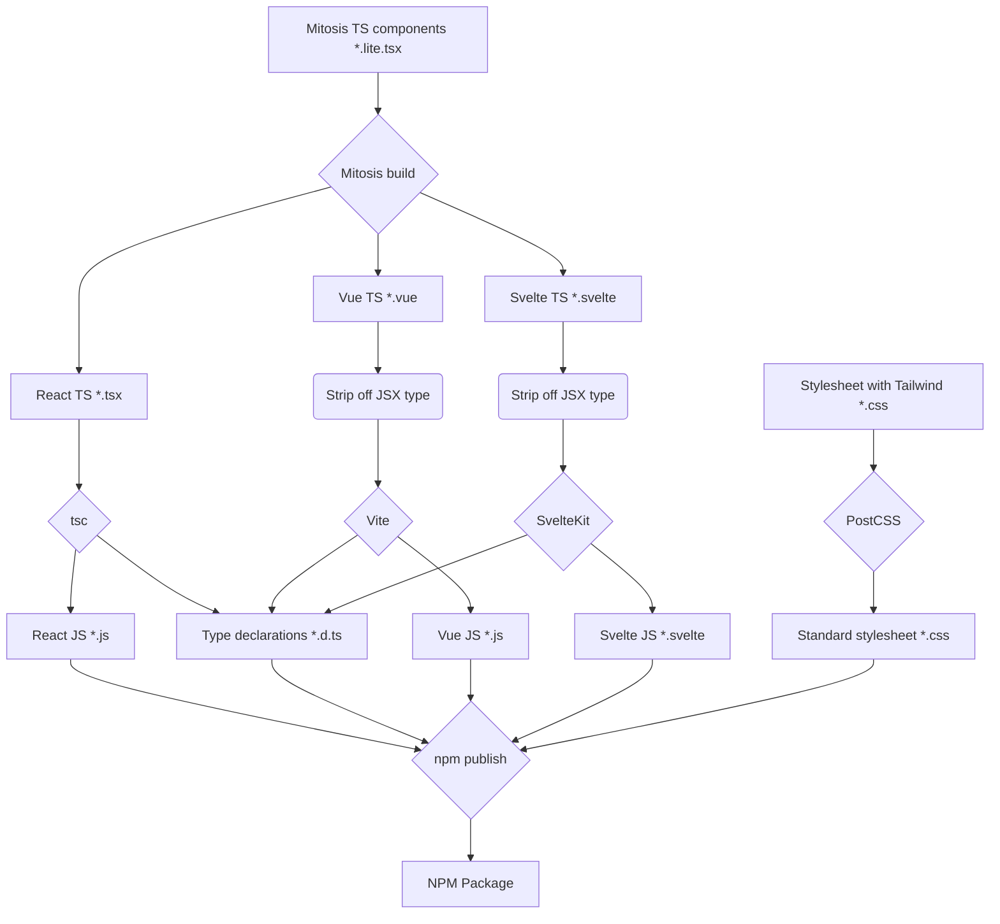

# Wevis's Design System

Monorepo for WeVis design system documentation and cross-framework UI components

**[Documentation](https://wevisdemo.github.io/design-systems)** for how to use the package

## 🍱 Project structure

Monorepo is managed by [Turborepo](https://turborepo.org)

- `/ui`: for [@wevisdemo/ui NPM package](https://www.npmjs.com/package/@wevisdemo/ui)
  - Cross-framework (Vue, Svelte and React) components with [Mitosis](https://github.com/BuilderIO/mitosis)
  - CSS stylesheets for components and typography system with [TailwindCSS](https://tailwindcss.com)
- `/docs`: Documentation site with [Astro](https://astro.build)

## 🏗️ How cross-framework UI package work

Mitosis allowed us to write a single `.lite.tsx` component and compiled to TypeScript React, Vue, and Svelte. Then, to make it importable by both JavaScript/TypeScript project, each component is transformed into a JavaScript format with corresponded type declaration (.d.ts) file.



## 🪄 Commands

Run development server, enable re-compile and hot-reload on changes

```sh
npm run dev
```

Build packages and documentation site

```sh
npm run build
```
